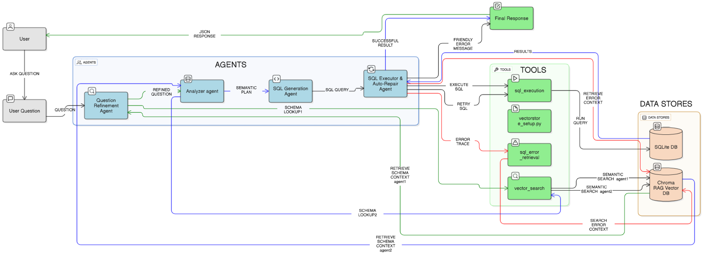
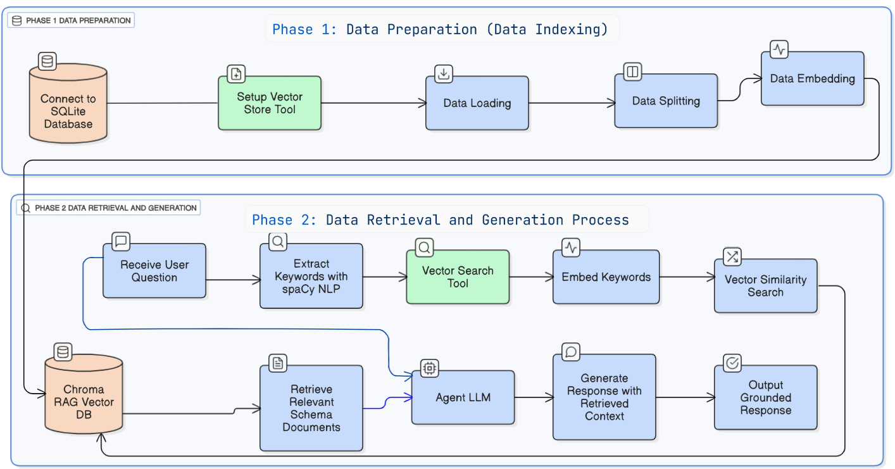
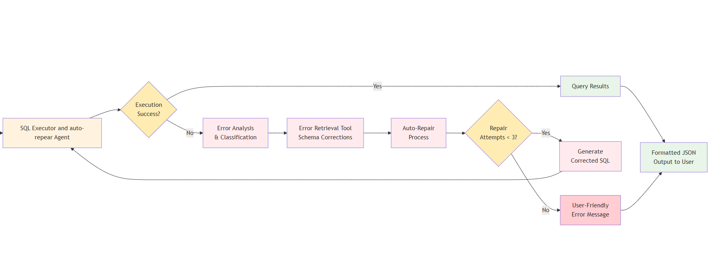
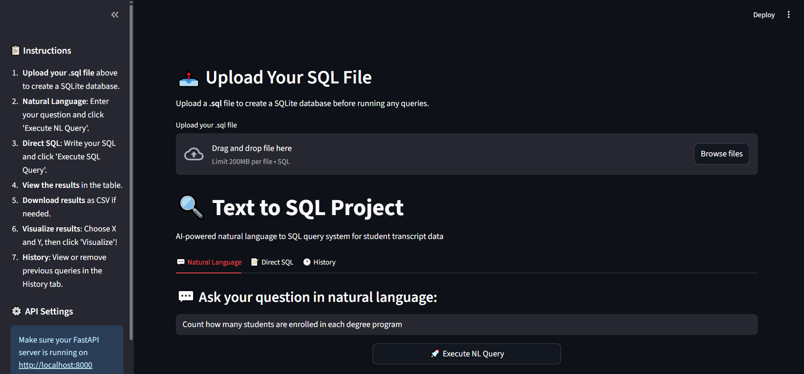
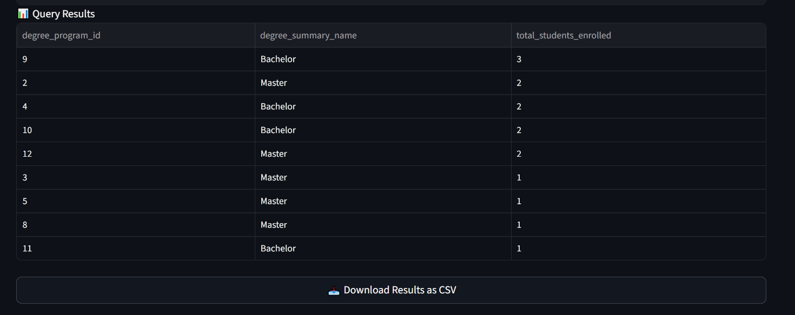
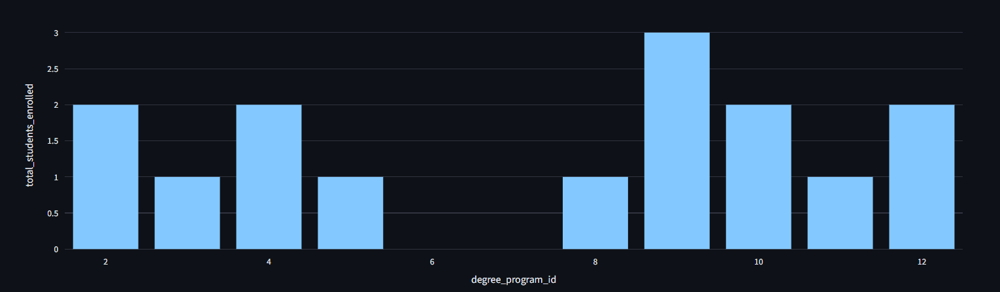
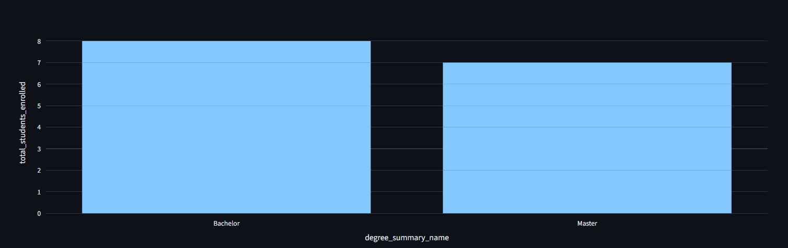
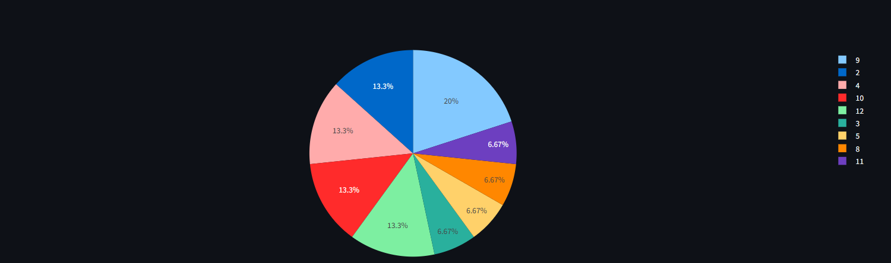
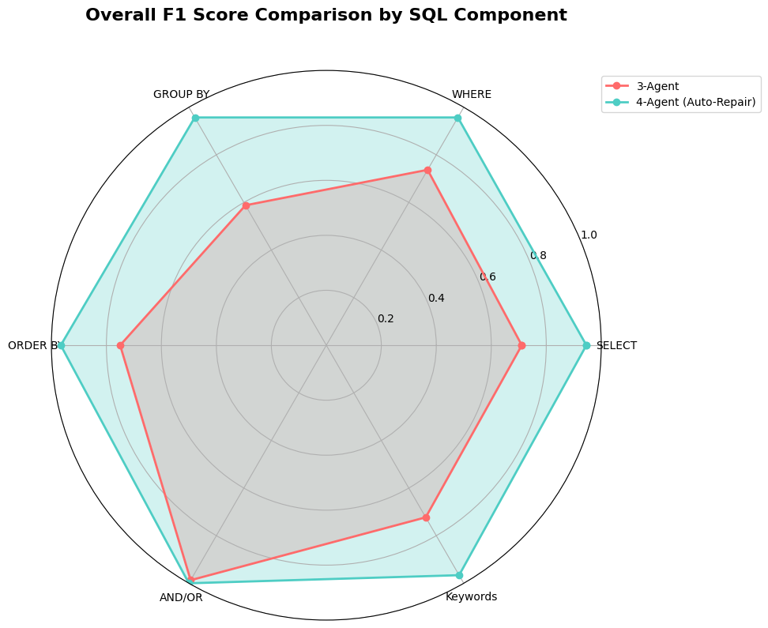

# CrewToSQL: RAG-Driven Multi-Agent Framework for Self-Correcting Text-to-SQL Generation

**A Comprehensive Approach to Natural Language Database Querying**

[](https://python.org)
[](https://fastapi.tiangolo.com/)
[](https://streamlit.io/)
[](LICENSE)

##  Overview

CrewToSQL is an innovative multi-agent text-to-SQL system that leverages Retrieval-Augmented Generation (RAG) and auto-repair capabilities to transform natural language queries into accurate SQL statements. The system achieves **89.7% execution accuracy**, representing a **34.6 percentage point improvement** over baseline systems.

### Key Features

- ** Multi-Agent Architecture**: 4 specialized agents working collaboratively
- ** Auto-Repair Capabilities**: Self-correcting SQL generation with iterative refinement
- ** RAG Integration**: Context-aware database understanding using ChromaDB
- ** High Accuracy**: Perfect accuracy (100%) on medium and hard complexity queries
- ** Modern Web Interface**: FastAPI backend with Streamlit frontend
- ** Rich Visualizations**: Interactive charts and data exploration tools

##  System Architecture
The CrewToSQL system implements a sophisticated multi-agent architecture that transforms natural language queries into accurate SQL statements through a coordinated workflow.



System Architecture and Workflow of the CrewToSQL: A RAG-Enhanced Multi-Agent Framework for Natural Language to SQL over relational Databases.
This figure illustrates the overall architecture and workflow, depicting the journey from user question to SQL answer.





Two-Phase Retrieval-Augmented Generation Pipeline Used in CrewToSQL System
This figure shows the detailed two-phase RAG pipeline that enables semantic retrieval and generation for SQL query creation.




SQL Execution and Auto-Repair Agent Workflow. This flowchart illustrates the intelligent error detection and correction process, showing how the system handles SQL execution failures through systematic error analysis, retrieval-based corrections, and iterative repair attempts (up to 3 attempts) before providing user-friendly error messages.

The agent implements a three-stage repair strategy:

-Schema Correction: Focuses on schema-related issues using the SQLErrorRetrievalTool to analyze error messages and identify structural problems
-Syntax & Logic Repair: Addresses syntax and logical errors through pattern-based correction mechanisms
-Query Restructuring: Handles complex errors while maintaining original query intent through intelligent restructuring

The repair process is limited to three attempts to prevent infinite loops, with each attempt informed by specific errors and relevant schema information. If all repairs fail, the system provides user-friendly error messages in non-technical terms while preserving debugging details for developers.


The system consists of four specialized agents in the Layer Agnets:

1. **Question Refinement Agent** - Clarifies and disambiguates natural language questions from the user to accurately understand their intent, using advanced NLP techniques and schema-aware reasoning.
2. **Analyzer Agent** - Retrieval-based schema understanding using RAG
3. **SQL Generator Agent** - Intelligent query construction
4. **SQL Execution and Auto-Repair Agent** - Validation and error correction

### Technology Stack

- **Backend**: FastAPI, Python 3.8+
- **Frontend**: Streamlit
- **LLM**: Google Gemini
- **Vector Store**: ChromaDB
- **Database**: SQLite , MySQL
- **Framework**: CrewAI, Langchain

##  Project Structure

```
student-sql-crew/
│
├── data/
│   ├── schema.sql
│   └── student_transcripts_tracking.sqlite   # Auto-generated at first run
│
├── src/
│   ├── initializer.py
│   ├── vectorstore_setup.py
│   ├── paths.py
│   ├── tools/
│   │   ├── sql_execution.py
│   │   ├── sql_error_retrieval.py
│   │   └── vector_search.py
│   ├── agents/
│   │   ├── query_understanding.py
│   │   ├── schema_retrieval.py
│   │   ├── sql_generator.py
│   │   └── sql_exec_repair.py
│   └── tasks/
│       ├── query_understanding_task.py
│       ├── schema_retrieval_task.py
│       ├── sql_generation_task.py
│       └── sql_exec_repair_task.py
│
├── web/
│   ├── app.py                    # FastAPI backend
│   ├── streamlit_app.py          # Streamlit frontend
│   ├── requirements_api.txt      # API dependencies
│   └── requirements_streamlit.txt # Frontend dependencies
│
├── chroma_data1/                 # Auto-generated vector store
├── .env                          # Environment variables
├── requirements.txt
├── build.py
└── .gitignore
```

##  Quick Start

### Prerequisites

- Python 3.8 or higher
- Google Gemini API key

### Installation

1. **Clone the repository**
   ```bash
   git clone https://github.com/yourusername/CrewToSQL.git
   cd CrewToSQL
   ```

2. **Set up environment variables**
   ```bash
   # Create .env file
   echo "GEMINI_API_KEY=your_gemini_api_key_here" > .env
   echo "DB_PATH=data/student_transcripts_tracking.sqlite" >> .env
   echo "CHROMA_DIR=chroma_data1" >> .env
   ```

3. **Install dependencies**
   
   For FastAPI Backend:
   ```bash
   pip install -r web/requirements_api.txt
   ```
   
   For Streamlit Frontend:
   ```bash
   pip install -r web/requirements_streamlit.txt
   ```

### Running the Application

1. **Start the FastAPI Backend**
   ```bash
   uvicorn web.app:app --reload
   ```
   API will be available at: http://localhost:8000

2. **Start the Streamlit Frontend** (in a new terminal)
   ```bash
   cd web
   streamlit run streamlit_app.py
   ```
   Application will be available at: http://localhost:8501

##  Usage

The frontend is built with Streamlit, providing an intuitive interface for natural language database querying:



Main application interface showing the natural language query input, database upload functionality, and tabbed navigation system.



Query results displayed in a clean tabular format showing degree program enrollment data with CSV download functionality.

### Visualization Features
The application allows users to explore data through multiple chart types with customizable parameters:



 Bar chart visualization showing total students enrolled by degree program ID.



Bar chart visualization displaying total students enrolled by degree type (Bachelor vs Master).



Pie chart visualization of student enrollment distribution across different degree programs.


### Web Interface Features
- **Natural Language Query Input**: Type your questions in plain English
- **Database Upload**: Upload your own database files
- **Tabbed Navigation**: Organized interface for different functionalities
- **Query Results**: Clean tabular display with CSV download functionality
- **Interactive Visualizations**:
  - Bar charts for categorical data analysis
  - Pie charts for distribution visualization
  - Customizable chart parameters

### Example Queries

```
"Show me all students enrolled in Bachelor programs"
"What is the total enrollment by degree type?"
"List students with GPA above 3.5"
"Which degree program has the highest enrollment?"
```

## 📊 Performance Metrics

- **Overall Execution Accuracy**: 89.7%
- **Improvement over Baseline**: +34.6 percentage points
- **Complex Query Accuracy**: 100% (medium and hard difficulty)
- **GROUP BY Operations**: +36.9 percentage point improvement




Overall F1 Score Comparison by SQL Component. Radar chart visualization shows the 4-agent system (teal area) completely encompassing and extending beyond the 3-agent system (red area) across all six SQL components, demonstrating comprehensive improvements.

##  Key Contributions

1. **Modular 4-Agent Framework** with specialized task distribution
2. **RAG Integration** for dynamic schema understanding
3. **Dedicated Auto-Repair Capabilities** for systematic error correction
4. **Comprehensive Evaluation Methodology** with extensive testing
5. **Production-Ready Performance** suitable for real-world applications

## 🎓 Academic Context

This project was submitted as a **Final Year Project (PFE)** in partial fulfillment of the requirements for the **Master in Embedded Artificial Intelligence**.

### Applications

- **Educational**: Database learning and teaching
- **Business Intelligence**: Natural language data analysis
- **Analytics**: Simplified database querying for non-technical users

##  Contributing

Contributions are welcome! Please feel free to submit a Pull Request. For major changes, please open an issue first to discuss what you would like to change.

##  License

This project is licensed under the MIT License - see the [LICENSE](LICENSE) file for details.

##  Contact

**LinkedIn**: [Your LinkedIn Profile](your-linkedin-url)

##  Acknowledgments

- Google Gemini for LLM capabilities
- CrewAI framework for multi-agent orchestration
- ChromaDB for vector storage and retrieval
- Streamlit and FastAPI for the web interface

---

*CrewToSQL represents a significant advancement in automated database query generation, demonstrating that multi-agent architectures with error correction can achieve production-ready performance for natural language database querying.*
